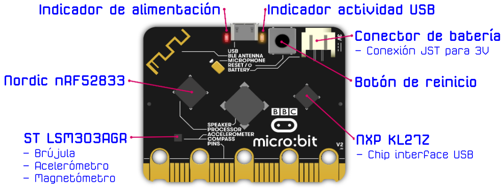

# Hardware
En la imagen 1 tenemos una descripción gráfica de todos los elementos que integra la micro:bit v2 en su vista frontal.

| Imagen 1 |
|:-:|
|  |
| Vista frontal |

En la imagen 2 tenemos una descripción gráfica de todos los elementos que integra la micro:bit v2 en su vista posterior.

| Imagen 2 |
|:-:|
|  |
| Vista posterior |

## Procesador nRF52
Es donde se ejecutan los programas de usuario. El nRF52 proporciona todos los pines GPIO accesibles para el usuario. Hay integrado un periférico de radio de 2.4GHz que se utiliza para proporcionar capacidades de radio y de Bluetooth. En la tabla siguiente vemos sus principales características.

| Item  | Detalles |
|---|---|
| Modelo | [Nordic nRF52833](https://www.nordicsemi.com/Products/Low-power-short-range-wireless/nRF52833) |
| Variante del núcleo | [Procesador Arm Cortex-M4 de 32 bit con FPU](https://developer.arm.com/ip-products/processors/cortex-m/cortex-m4) |
| Memoria Flash ROM | 512 KB |
| Memoria RAM | 128 KB |
| Velocidad | 64 MHz |

## Comunicación inalámbrica Bluetooth
El dispositivo integrado de 2,4 GHz [Nordic S113](https://www.nordicsemi.com/Software-and-Tools/Software/S113) admite comunicaciones Bluetooth a través del dispositivo de bajo consumo, permitiendo comunicar la micro:bit con dispositivos Bluetooth como teléfonos inteligentes y tabletas.

| Item  | Detalles |
|---|---|
| Pila (stack) | Bluetooth 5.1 con Bluetooth de bajo consumo (BLE) |
| Banda | 2.4GHz ISM (Industrial, Scientific and Medical) 2.4GHz..2.41GHz |
| Canales | 50 de 2MHz. Uitilizados del 0 al 39 |
| Sensibilidad | -93 dBm en modo BLE |
| Potencia de transmisión | -40 dBm a 4 dBm |
| Perfiles | [BBC micro:bit profile](https://lancaster-university.github.io/microbit-docs/ble/profile/) |
| Mas información | [Bluetooth](https://tech.microbit.org/bluetooth) |

## Radiocomunicaciones de bajo nivel
El transceptor integrado de 2,4 GHz soporta una serie de estándares de comunicaciones por radio sobre los que está construido el protocolo de radio micro:bit. Este protocolo proporciona una interfaz de radio sencilla de transmisión de pequeños paquetes con otros dispositivos que lo admiten, como por ejemplo, otras micro:bit.

| Item  | Detalles |
|---|---|
| Protocolo | [Radio micro:bit](https://lancaster-university.github.io/microbit-docs/ubit/radio) |
| Banda de frecuencia | 2.4GHz |
| Velocidad de canal | 1 Mbps o 2 Mbps |
| Encriptación | Ninguna |
| Canales | 80 (0...80) |
| Códigos de grupo | 255 |
| Potencia de transmisión | Ocho valores configurables por el usuario, 0 (-30 dbm) a 7 (+4 dbm) |
| Tamaño de carga | 32 (estándar) o 255 (si se configura) |
| Mas información | [Radio micro:bit](https://lancaster-university.github.io/microbit-docs/ubit/radio) |

## Botones
Los dos botones de la parte frontal y el botón de la parte posterior son botones pulsadores normales. El botón de la parte posterior está conectado al procesador de interfaz KL27 y al procesador NRF52 para reiniciar el sistema. De esta forma se garantiza que la aplicación se reiniciará independientemente de si se alimenta desde USB o desde una batería.

Los botones frontales A y B se pueden programar en la aplicación de usuario con cualquier propósito. Los rebotes de A y B se eliminan por software, y también incluyen pulsación corta, pulsación larga y detección de pulsación simultanea de A y B. Los botones funcionan en modo eléctrico invertido típico, donde una resistencia pull-up asegura un '1' lógico cuando se suelta el botón y un '0' lógico cuando se pulsa el botón. Ambos botones están conectados a pines GPIO que también son accesibles en el conector de borde.

| Item  | Detalles |
|---|---|
| Tipo | Dos pulsadores de usuario y un pulsador de sistema |
| Rebotes | Se eliminan por software con periodos de 54 ms |
| Pullup | Los botones A y B con resistencias externas de 4K7 y el de sistema con 10K |

## Pantalla
La pantalla es una matriz de LED de 5x5. El software en tiempo de ejecución actualiza repetidamente esta matriz a alta velocidad, de modo que está dentro del rango de visión de persistencia del usuario y no se detecta parpadeo. Esta matriz de LED también se utiliza para detectar luz ambiental.

| Item  | Detalles |
|---|---|
| Tipo | LED rojo miniatura de montaje |
| Estructura física | Matriz de 5x5 |
| Estructura eléctrica | 5x5 |
| Control de intensidad | Control de hasta 255 pasos por software |
| Sensibilidad | Estimación de luz ambiente por algoritmo de software |
| Rango de sensibilidad | 10 niveles, de apagado a luminosidad total |
| Sensibilidad de color | centro del rojo (700 nm) |

## Sensor de movimiento
La micro:bit dispone de un chip que combina acelerómetro y magnetómetro proporcionando así detección en 3 ejes y de campo magnético. Incluye detección de gestos en el hardware (como por ejemplo de caídas) y detección adicional de gestos (por ejemplo, logotipo arriba, logotipo abajo, agitación) a través de software. Un algoritmo de software en tiempo de ejecución utiliza el acelerómetro integrado para convertir las lecturas en una brújula independiente de la orientación de la placa. La brújula debe calibrarse antes de su uso, y el software en tiempo de ejecución inicia automáticamente el proceso de calibración. Este dispositivo está conectado al procesador a través del bus I2C.

| Item  | Detalles |
|---|---|
| Modelo | [LSM303AGR](https://www.st.com/en/mems-and-sensors/lsm303agr.html) |
| Características | 3 campos magnéticos y aceleración en e ejes. Rangos 2/4/8/16g |
| Resolución | 8/10/12 bits |
| Gestos "on board" | Caída libre |
| Otros gestos | Se implementan por software en tiempo de ejecución |

## Detección de temperatura
El procesador NRF52 tiene un sensor de temperatura integrado. Este se expone por software en tiempo de ejecución y proporciona una estimación de la temperatura ambiente.

| Item  | Detalles |
|---|---|
| Rango de sensibilidad | -40 ºC ... 105 ºC |
| Resolución | Pasos de 0.25 ºC |
| Precisión | +/- 5 ºC (sin calibrar) |
| Mas información | [Termómetro DAL](https://lancaster-university.github.io/microbit-docs/ubit/thermometer/) |

## Altavoz
Además de poder emitir sonido vía PWM por los pines, la micro:bit v2 incorpora un altavoz magnético ya montado en la placa donde se puede reflejar el sonido.

| Item  | Detalles |
|---|---|
| Tipo | JIANGSU HUANENG MLT-8530 |
| SPL (Sound Pressure Level) | 80dB @ 5V, 10cm |
| Frecuencia de resonancia propia | 2700Hz |
| Mas información | [Datasheet](https://datasheet.lcsc.com/szlcsc/1811151451_Jiangsu-Huaneng-Elec-MLT-8530_C94599.pdf) |

## Micrófono
Un micrófono MEMS (Micro (o nano) Electrical-Mechanical System) incorporado proporciona una entrada de sonido a la micro:bit y un indicador LED integrado en la parte frontal de la placa muestra al usuario cuando está encendido.

| Item  | Detalles |
|---|---|
| Tipo | Knowles SPU0410LR5H-QB-7 MEMS |
| Sensibilidad | -38dB ±3dB @ 94dB SPL |
| Relación señal ruido (SNR) | 63dB |
| Máxima ganancia digital (AOP) | 118dB SPL |
| Rango de frecuencia | 100Hz ... 80kHz |
| Patrón polar | Omnidireccional |
| Mas información | [Datasheet](https://www.knowles.com/docs/default-source/model-downloads/spu0410lr5h-qb-revh32421a731dff6ddbb37cff0000940c19.pdf?Status=Master&sfvrsn=cebd77b1_4) |

## Pines de propósito general de entrada/salida
En el conector de borde hay muchos de los circuitos GPIO del procesador. Algunos de estos circuitos se comparten con otras funciones de la micro:bit, pero muchos de estos circuitos adicionales pueden reasignarse para uso de propósito general si se desactivan algunas funciones del software.

| Item  | Detalles |
|---|---|
| Anillos | 3 de entrada/salida y 2 de alimentación compatibles con banana de 4mm y pinza de cocodrilo |
| Funciones GPIO | 19 pines asignables GPIO  2 para interfaz I2C externa   6 para la pantalla o detección de luz   2 para detectar los botones de la placa   1 reservado para interfaz de accesibilidad   Los 19 se pueden asignar como entrada o salida digital   Los 19 pueden asignarse para hasta 3 canales PWM simultáneos   Los 19 se pueden asignar para transmisión serie y un canal de recepción serie   6 pueden asignarse como entrada analógica   3 pueden asignarse para comunicación SPI   3 se pueden asignar para hasta 3 entradas de detección táctil  |
| Resolución conversor A/D | 10 bits (0...1023) |
| Distancia entre pines | 1.27mm, 80 vias a doble cara |

## Alimentación
La alimentación de la micro:bit puede ser a través de los 5V del conector USB o mediante una batería de 3V enchufada al conector JST. También es posible alimentar a la micro:bit desde los anillos 3V/GND en el conector de borde. Los anillos 3V/GND se pueden usar para suministrar energía a circuitos externos. La placa utiliza un regulador de baja caída o LDO especificado hasta 300 mA con corte térmico para protección contra cortocircuitos.

| Item  | Detalles |
|---|---|
| Rango de operación | 1.8V ... 3.6V |
| Consumo de corriente | 300mA máximo |
| Asignado a periféerico "on board" | 90mA |
| Conector de batería | JST X2B-PH-SM4-TB |
| Máxima corriente prevista para el conector de borde | 190mA |
| Mas información | [Power Supply](https://tech.microbit.org/hardware/powersupply) |

## Interface
El chip de interfaz maneja la conexión USB y se usa para actualizar el código nuevo en la micro:bit, enviar y recibir datos en serie de forma bidireccional.

| Item  | Detalles |
|---|---|
| Modelo | [MKL27Z256VFM4](https://www.nxp.com/part/MKL27Z256VFM4#/) |
| Núcleo | [Arm Cortex-M0+](https://www.arm.com/products/processors/cortex-m/cortex-m0plus.php) |
| Flash ROM | 256KB (128KB reservados para uso como almacenamiento) |
| RAM | 16KB |
| Velocidad | 48MHz |
| Depuración | SWD |
| Mas información | [DAPLink](https://tech.microbit.org/software/daplink-interface/), [Manual del KL27](https://www.nxp.com/docs/en/reference-manual/KL27P64M48SF6RM.pdf), [datasheet KL27](https://www.nxp.com/docs/en/data-sheet/KL27P64M48SF6.pdf) |

## Comunicaciones USB
La placa micro:bit tiene una pila de comunicaciones USB incorporada integrada en el firmware del chip de interface. Esta pila brinda la capacidad de arrastrar y soltar archivos en la unidad MICROBIT para cargar código en el procesador. También permite que los datos en serie se transmitan desde y hacia el procesador de micro:bit a través de USB a un ordenador externo, y es compatible con el protocolo CMSIS-DAP para la depuración de programas de aplicación en el host.

| Item  | Detalles |
|---|---|
| Conector | USB micro, MCR-B-S-RA-SMT-CS5-TR |
| Versión USB | Dispositivo a velocidad completa 2.0 |
| Velocidad | 12Mbit/s |
| Clases USB soportadas | [Clase de almacenamiento masivo (MSC)](https://en.wikipedia.org/wiki/USB_mass_storage_device_class)  [Clase dispositivo de comunicaciones (CDC)](https://en.wikipedia.org/wiki/USB_communications_device_class)  |
| Mas información | [DAPLink](https://tech.microbit.org/software/daplink-interface/) |

## Depuración
El procesador de interface se puede utilizar con herramientas de host especiales para depurar el código que se ejecuta en el procesador de la aplicación. Se conecta al procesador de aplicaciones a través de 4 cables de señal. El código del procesador de la interfaz KL27 también se puede depurar a través de su interfaz de depuración del software SWD integral, por ejemplo, para cargar el código del cargador de arranque inicial en este procesador en el momento de la fabricación, o para recuperarlo si se ha perdido.

| Item  | Detalles |
|---|---|
| Protocolo | CMSIS-DAP |
| Opciones | JLink/OB (via different firmware) |
| Mas información | [Mbed debugging micro:bit](https://os.mbed.com/docs/mbed-os/v6.0/debug-test/debug-microbit.html) |

## Mecánicos
Hay disponibles algunos [dibujos CAD 2D y 3D y modelos de la micro:bit](https://github.com/microbit-foundation/microbit-reference-design) que incluyen todas las dimensiones importantes. Estos modelos se pueden utilizar como base para generar imágenes de proyecto y marketing realmente agradables de micro:bit, pero también como base para la fabricación precisa de accesorios, por ejemplo, mediante impresión 3D.

| Item  | Detalles |
|---|---|
| Dimensiones | 51,60 mm (ancho) 42,00 mm (alto) 11,65 mm (profundidad)  Altura del botón a la placa 4,55mm   altura del altavoz 3mm  Conector JST 5,50mm  |

