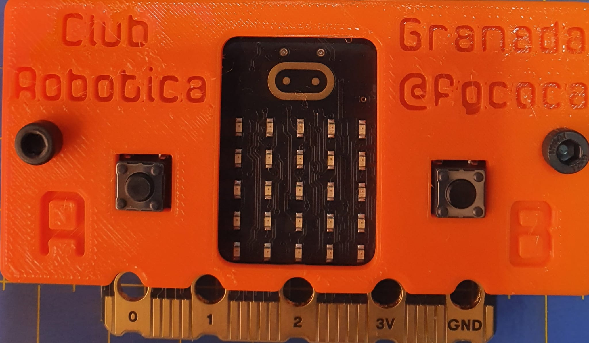

# Mis notas sobre BBC micro:bit v2
En estas notas voy a presentar la versión dos de la BBC micro:bit en cuanto al hardware que implementa y sus principales características.

Haré un breve repaso de las novedades respecto a la versión anterior.

Finalmente incluiré el diseño completo de un protector imprimible en 3D para la misma.

El aspecto final de la placa con su protector lo vemos a continuación.

| BBC micro:bit v2 con protector |
|:-:|
|  |

