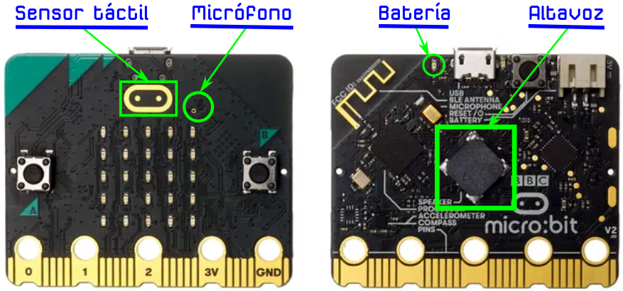

# Novedades
La novedad mas importante de la nueva tarjeta micro:bit es que incorpora un procesador mas potente que su predecesora. También incorpora indicador de batería,  micrófono, altavoz y un sensor táctil en el logotipo que aumentan sus posibilidades de utilización. En la imagen 1 se señalan todos estos nuevos elementos.

| Imagen 1 |
|:-:|
|  |
| Novedades |

Las principales diferencias con micro:bit v1 quedan descritas a continuación:

* **El logo es un botón táctil**. Se trata de un botón táctil capacitivo que nos da la posibilidad de pulsar de cuatro maneras diferentes, botón A, botón B, botón A y botón B a la vez y botón táctil.

* **Micrófono**. Se trata de un micro digital MEMS al que se asocia un indicador LED con el icono de un micrófono. El término MEMS, del inglés MicroElectroMechanical Systems, se refiere a la tecnología electromecánica de dispositivos microscópicos o sistemas microelectromecánicos.

* **Modo ahorro de energía**. Esta nueva función de ahorro o modo de espera detendrá el programa que se esté ejecutando en la micro:bit hasta que se pulse el botón de reinicio.

* **Altavoz**. Permite incorporar sonidos a nuestros proyectos.

La microbit v2 es cuatro veces mas posibilidades de procesamiento y ocho veces mas memoria RAM que micro:bit v1, y esto gracias a la incorporación de un procesador nRF52833 ARM Cortex de 64 MHz.

Incorpora 512 KB de memoria Flash y 128 KB de memoria RAM.